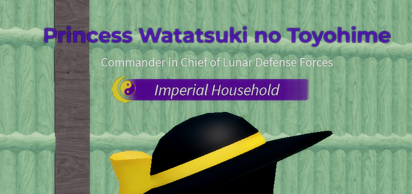
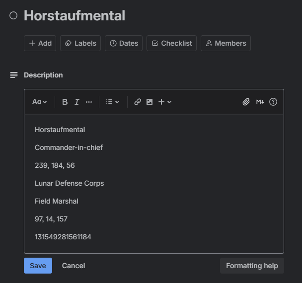

# NameRankTitles

A customizable overhead name tag system for Roblox with Trello integration, division/rank displays, and team-based coloring.

<div align="center">
    <picture>
        
    </picture>
</div>

## Features

- **Trello Integration**: Fetch and display custom titles from Trello cards
- **Team-Based Coloring**: Automatic tag coloring based on player's team
- **Division System**: Display player divisions with configurable icons, colors, and priorities
- **Group Integration**: Supports multiple Roblox group IDs with rank-based filtering
- **Health Indicators**: Dynamic health bars with color interpolation (red → yellow → green)
- **Click-to-Inspect**: Client-side interaction to view detailed player information
- **Variable Replacement**: Dynamic text with `#username#` and `#grouprole:GROUPID#` support
- **Priority System**: Automatically select the highest priority division for players in multiple groups
- **Custom Group Rank Names**: Override default group rank names with custom text and icons

## Installation

1. Download the latest release from [GitHub Releases](https://github.com/Horstaufmental/Horsts-Public-Assets-Clusters/releases)
2. Install the following components:
   - Place `NameRankTitles/ServerScriptService/NameServer` script in `ServerScriptService/`
   - Place `NameRankTitles/StarterPlayerScripts/NameClientClickHandler` in `StarterPlayer/StarterPlayerScripts/`
3. Configure your settings in `Config` under `NameServer` (see Configuration section below)

## Configuration

### Trello Setup

Edit `Config.luau` to add your Trello credentials:

```lua
Config.board = ""     -- Your Trello board ID (from URL: trello.com/b/HERE/)
Config.key = ""       -- Your API key from https://trello.com/power-ups/admin/
Config.token = ""     -- Your API token (32 characters)
Config.listName = "Titles"  -- Name of the list containing title cards
```

**Getting Trello Credentials:**
1. Visit https://trello.com/power-ups/admin/
2. Create a new Power-Up or select an existing one
3. Copy your **API Key** from the "API Key" section
4. Click "Token" to generate a new **API Token** (must be 32 characters)
5. Copy your board ID from the URL: `https://trello.com/b/BOARDID/board-name`

### Custom Group-Wide Rank Names

Customize rank names and icons for specific groups in `Config`. This provides a basic way to override default rank names without using Trello.

```lua
Config.customRanks = {
    [groupId] = {
        -- {"RankId", "CustomRankName", "CustomRankIcon"}
        -- Set second/third argument to nil if undesired
        
        -- Regular custom rank name & icon
        {"20", "Sergeant Major", "rbxassetid://12345"},
        
        -- "And above" - affects rank 100 and all higher ranks
        {"100>", "Commanders", nil},
        
        -- "And below" - affects rank 10 and all lower ranks
        {"<10", nil, "rbxassetid://54321"},
        
        -- Range-based - affects ranks 50 through 70
        {"50-70", "Officers", nil},
    },
}
```

**Example:**

```lua
Config.customRanks = {
    [12345678] = {
        {"255", "Supreme Commander", "rbxassetid://98765"},
        {"200>", "High Command", nil},
        {"100-199", "Officers", "rbxassetid://11111"},
        {"50-99", "NCOs", nil},
        {"<49", "Enlisted", nil},
    },
}
```

**Special Keywords:**
- `>` - All ranks above (e.g., `100>` = ranks 100+)
- `<` - All ranks below (e.g., `<10` = ranks 1-10)
- `-` - Range of ranks (e.g., `50-70` = ranks 50 to 70)

**Note:** For more advanced customization with custom names, colors, and divisional bars, use the [Trello system](#trello-card-format) instead.

### Division Configuration

Configure divisions in `Config.luau`:

```lua
Config.divisions = {
    ["Team Name"] = {
        ["Division Name"] = {
            groupID,          -- Roblox group ID
            divisionIcon,     -- "rbxassetid://12345"
            rgb,              -- Color3.fromRGB(R,G,B) or nil for team color
            minRank,          -- Minimum rank (1-255)
            maxRank,          -- Maximum rank (1-255)
            priority,         -- Priority (higher = shown first)
        },
    }
}
```

**Example:**

```lua
Config.divisions = {
    ["Red Team"] = {
        ["Elite Forces"] = {
            12345678,                      -- Group ID
            "rbxassetid://14842204514",   -- Division icon
            Color3.fromRGB(200, 0, 0),    -- Red bar color
            10,                            -- Min rank 10
            255,                           -- Max rank 255
            10,                            -- High priority
        },
        ["Standard Infantry"] = {
            12345678,
            "rbxassetid://14842204514",
            nil,                           -- Use team color
            1,
            9,
            1,                             -- Low priority
        },
    }
}
```

### Trello Card Format

Create cards in your Trello list with the following format:

- **Card Name**: Player username or `Group:GROUPID` for group-wide titles
- **Card Description** (7 lines):
  1. Top line of name (supports `#username#`, `#grouprole:GROUPID#`)
  2. Bottom line of name (rank text)
  3. Name color in RGB format (e.g., `255, 0, 0`) or `N/A`
  4. Division bar text
  5. Division bar rank text or `N/A`
  6. Division bar color in RGB format (e.g., `0, 100, 200`)
  7. Division bar icon (asset ID number only)

**Example Card:**

```
Card Name: Horstaufmental

Card Description:
Horstaufmental
Commander-in-chief
239, 184, 56
Lunar Defense Corps
Field Marshal
97, 14, 157
131549281561184
```

<div align="left">
    <picture>
        
    </picture>
</div>

**Group-Wide Card Example:**

```
Card Name: Group:12345678

Card Description:
#username#
#grouprole:12345678#
N/A
Division Name
N/A
100, 100, 100
14842204514
```

<div align="left">
    <picture>
        
    </picture>
</div>

## Team Setup

For proper group integration, ensure your Teams have an **IntValue** named `groupID`:

1. Create or select a Team in `game.Teams`
2. Add an IntValue child to the Team
3. Name it `groupID`
4. Set its Value to your Roblox group ID

**Example in Studio:**
```
Teams
└── MyTeam
    └── groupID (IntValue) = 12345678
```
<div align="left">
    <picture>
        
    </picture>
</div>

## Features in Detail

### Variable Replacement

Use these variables in Trello card descriptions:

- `#username#` - Replaced with the player's username
- `#grouprole:GROUPID#` - Replaced with the player's role in the specified group

### Priority System

When a player is in multiple divisions:
- The division with the **highest priority** is displayed
- If priorities are equal, the **highest rank** within that division wins
- Set priority as the 6th parameter in division configuration (default: 0)

### Health System

- Health bars automatically show when player health < max health
- Colors interpolate based on health percentage:
  - 0-50%: Red → Yellow
  - 50-100%: Yellow → Green
- Smooth transitions using TweenService

### Click-to-Inspect

Players can click on other players to:
- Highlight them with a distance-based color indicator
- View their division rank (typewriter animation)
- Maximum distance: 15 studs (configurable in code)

## Important Notes

- **Studio Testing**: `PlayerAdded` events may not fire in Studio solo mode. Use **"Clients and Servers"** mode or test in-game
- **Trello Cache**: The system updates Trello data every 30 seconds to minimize API calls
- **Character Health**: Health bars are designed for characters with ≤100 max health
- **Name Distance**: The system sets `NameDisplayDistance` and `HealthDisplayDistance` to 0 (tags replace default nameplates)

## Troubleshooting

### Tags not appearing
- Check that `Tag` is properly placed under `NameServer`
- Verify character Head exists before tag creation
- Test in "Clients and Servers" mode, not solo Studio mode

### Trello titles not loading
- Ensure that `Allow HTTP Requests` is turned on in the game settings
- Verify your API key, token, and board ID in Config.luau
- Check that your list name matches exactly (case-sensitive)
- Ensure Trello cards are formatted correctly (7 lines in description)
- Check output for HTTP errors

### Division not showing
- Verify the player is in the specified group
- Check that rank is within minRank and maxRank range
- Ensure Team has a `groupID` IntValue child
- Verify team name matches exactly in Config.divisions

### Group roles not working
- Ensure Teams have `groupID` IntValue children
- Verify group IDs are correct (numeric, not group name)
- Check that players are actually in the groups

## Compatibility

- **Adonis Admin**: Use [RankTitlesUtils](../RankTitlesUtils/) plugin for in-game tag management
- **Custom Admin Systems**: Commands can be adapted to other admin systems

## License

This asset is licensed under the **MPL-2.0** (Mozilla Public License Version 2.0).

**Special Exception**: `Config.luau` has an exception - modifications to this file do not create any obligation to publish the modified version.

See [LICENSE](/LICENSE) for full details.

## Credits

Originally made by **K_ieraH** and **Nucl3arPlayz**  
Modified by **Horstaufmental**
